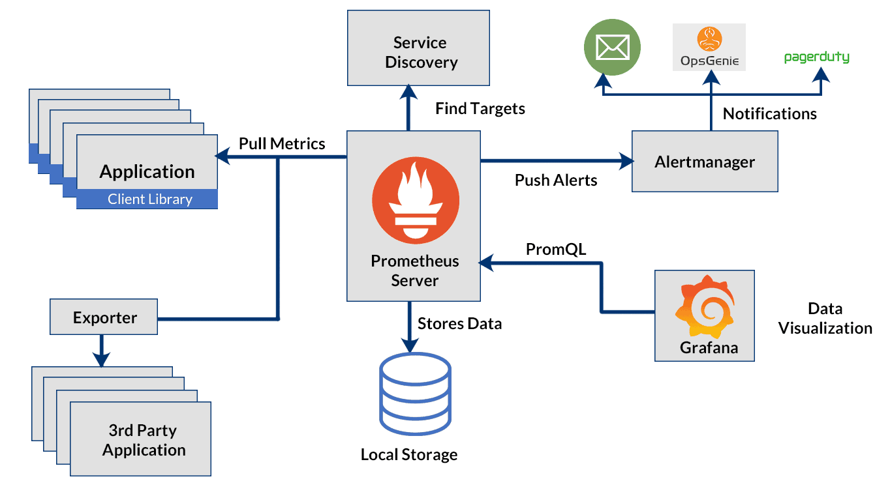
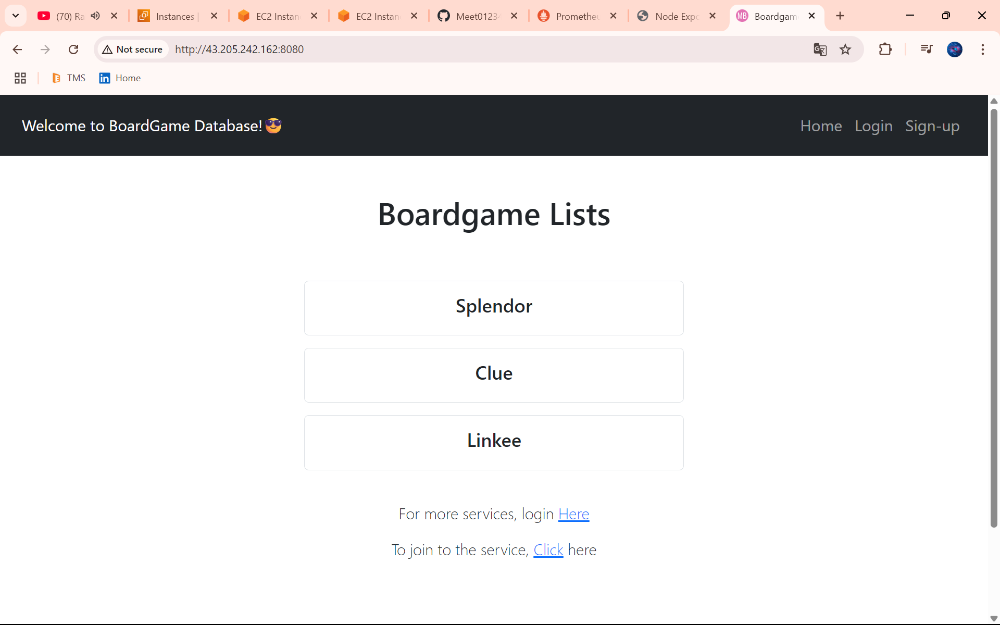

# 🔔 Monitoring & Alerting Stack with Prometheus



This guide walks you through setting up a powerful and production-ready monitoring and alerting stack using multiple tools on two Ubuntu EC2 instances (Monitoring & VM).

---

## 🚀 Instance Setup

### ✅ Launch 2 EC2 Instances (t2.medium)
1. **Monitoring Server**
2. **VM (Application Server)**

---

## 🧭 Monitoring Instance Configuration

```bash
sudo su
apt update -y
```

# Install Prometheus
```bash
wget https://github.com/prometheus/prometheus/releases/download/v3.5.0-rc.0/prometheus-3.5.0-rc.0.linux-amd64.tar.gz
```
```bash
tar -xvf prometheus-3.5.0-rc.0.linux-amd64.tar.gz
```
```bash
rm -rf prometheus-3.5.0-rc.0.linux-amd64.tar.gz
```
```bash
mv prometheus-3.5.0.linux-amd64 prometheus
```

# Install Blackbox Exporter
```bash
wget https://github.com/prometheus/blackbox_exporter/releases/download/v0.27.0/blackbox_exporter-0.27.0.linux-amd64.tar.gz
```
```bash
tar -xvf blackbox_exporter-0.27.0.linux-amd64.tar.gz
```
```bash
rm -rf blackbox_exporter-0.27.0.linux-amd64.tar.gz
```
```bash
mv blackbox_exporter-0.27.0.linux-amd64 blackbox_exporter
```

# Install Alertmanager
```bash
wget https://github.com/prometheus/alertmanager/releases/download/v0.28.1/alertmanager-0.28.1.linux-amd64.tar.gz
```
```bash
tar -xvf alertmanager-0.28.1.linux-amd64.tar.gz
```
```bash
rm -rf alertmanager-0.28.1.linux-amd64.tar.gz
```
```bash
mv alertmanager-0.28.1.linux-amd64 alertmanager
```

---

## 🔍 Start Prometheus, Alertmanager & Blackbox Exporter

```bash
cd prometheus
./prometheus &
```
---
access : `http://<Monitoring Public IP>:9090`


---

```bash
cd ../alertmanager/
./alertmanager &
```
---
access : `http://<Monitoring Public IP>:9093`


---

```bash
cd ../blackbox_exporter/
./blackbox_exporter &
```
---
access : `http://<Monitoring Public IP>:9115`


---

---

## ⚙️ Application VM Configuration

```bash
sudo su
apt update -y
```
```bash
# Clone project and setup node exporter
git clone <your repo>
```
```bash
cd <your repo>
```
```bash
wget https://github.com/prometheus/node_exporter/releases/download/v1.9.1/node_exporter-1.9.1.linux-amd64.tar.gz
```
```bash
tar -xvf node_exporter-1.9.1.linux-amd64.tar.gz
```
```bash
rm -rf node_exporter-1.9.1.linux-amd64.tar.gz
```
```bash
mv node_exporter-1.9.1.linux-amd64 node_exporter
```
```bash
cd node_exporter
./node_exporter &
```
---
access : `http://<VM Public IP>:9100`


---

---

## ☕ Run Spring Boot App

```bash
apt install openjdk-17-jre-headless maven -y
```
```bash
cd <your repo>
```
```bash
mvn package
```
```bash
cd target/
```
```bash
java -jar database_service_project-0.0.3-SNAPSHOT.jar
```

access : `http://<VM Public IP>:8080`

  

---

## 📡 Alerting Rules - alert_rule.yml (Inside Monitoring)

```bash
cd prometheus
```

```bash
nano alert_rule.yml
```

```yaml
groups:
- name: alert_rules
  rules:

  - alert: InstanceDown
    expr: up == 0
    for: 1m
    labels:
      severity: critical
    annotations:
      summary: "Endpoint {{ $labels.instance }} down"
      description: "{{ $labels.instance }} of job {{ $labels.job }} has been down for more than 1 minute."

  - alert: WebsiteDown
    expr: probe_success == 0
    for: 1m
    labels:
      severity: critical
    annotations:
      summary: "Website down"
      description: "The website at {{ $labels.instance }} is down."

  - alert: HostOutOfMemory
    expr: (node_memory_MemAvailable / node_memory_MemTotal) * 100 < 25
    for: 5m
    labels:
      severity: warning
    annotations:
      summary: "Host out of memory (instance {{ $labels.instance }})"
      description: "Node memory is filling up (< 25% left)\nVALUE = {{ $value }}\nLABELS: {{ $labels }}"

  - alert: HostOutOfDiskSpace
    expr: (node_filesystem_avail{mountpoint="/"} * 100) / node_filesystem_size{mountpoint="/"} < 50
    for: 1s
    labels:
      severity: warning
    annotations:
      summary: "Host out of disk space (instance {{ $labels.instance }})"
      description: "Disk is almost full (< 50% left)\nVALUE = {{ $value }}\nLABELS: {{ $labels }}"

  - alert: HostHighCpuLoad
    expr: (sum by (instance) (irate(node_cpu{job="node_exporter_metrics", mode="idle"}[5m]))) < 20
    for: 5m
    labels:
      severity: warning
    annotations:
      summary: "Host high CPU load (instance {{ $labels.instance }})"
      description: "CPU load is > 80%\nVALUE = {{ $value }}\nLABELS: {{ $labels }}"

  - alert: ServiceUnavailable
    expr: up{job="node_exporter"} == 0
    for: 2m
    labels:
      severity: critical
    annotations:
      summary: "Service Unavailable (instance {{ $labels.instance }})"
      description: "The service {{ $labels.job }} is not available\nVALUE = {{ $value }}\nLABELS: {{ $labels }}"

  - alert: HighMemoryUsage
    expr: (node_memory_Active / node_memory_MemTotal) * 100 > 90
    for: 10m
    labels:
      severity: critical
    annotations:
      summary: "High Memory Usage (instance {{ $labels.instance }})"
      description: "Memory usage is > 90%\nVALUE = {{ $value }}\nLABELS: {{ $labels }}"

  - alert: FileSystemFull
    expr: (node_filesystem_avail / node_filesystem_size) * 100 < 10
    for: 5m
    labels:
      severity: critical
    annotations:
      summary: "File System Almost Full (instance {{ $labels.instance }})"
      description: "File system has < 10% free space\nVALUE = {{ $value }}\nLABELS: {{ $labels }}"
```

---

## 🔧 Prometheus Configuration - prometheus.yml (Inside Monitoring)

```bash
nano prometheus.yml
```

```yaml
global:
  scrape_interval: 15s
  evaluation_interval: 15s

alerting:
  alertmanagers:
    - static_configs:
        - targets:
            - <Monitoring Public IP>:9093

rule_files:
  - "alert_rule.yml"

scrape_configs:
  - job_name: "prometheus"
    static_configs:
      - targets: ["localhost:9090"]

  - job_name: "node_exporter"
    static_configs:
      - targets: ["<VM Public IP>:9100"]

  - job_name: "blackbox"
    metrics_path: /probe
    params:
      module: [http_2xx]
    static_configs:
      - targets:
          - http://prometheus.io
          - https://prometheus.io
          - http://example.com:8080
    relabel_configs:
      - source_labels: [__address__]
        target_label: __param_target
      - source_labels: [__param_target]
        target_label: instance
      - target_label: __address__
        replacement: <Monitoring Public IP>:9115
```

---

## 📧 Alertmanager Configuration - alertmanager.yml (Inside Monitoring)

```bash
cd ../alertmanager/
```

```bash
nano alertmanager.yml
```

```yaml
global:
  smtp_smarthost: 'smtp.gmail.com:587'
  smtp_from: '<your_email@example.com>'
  smtp_auth_username: '<your_email@example.com>'
  smtp_auth_password: '<your_app_password>'

route:
  group_by: ['alertname']
  receiver: 'email-notifications'

receivers:
  - name: 'email-notifications'
    email_configs:
      - to: '<your_email@example.com>'
        send_resolved: true
```

---

## ✅ Final Step: Restart All Services (Inside Monitoring)

```bash
pgrep prometheus
```
```bash
kill <PID>
```
```bash
./prometheus &
```
```bash
pgrep alertmanager
```
```bash
kill <PID>
```
```bash
./alertmanager &
```
```bash
pgrep blackbox_exporter
```
```bash
kill <PID>
```
```bash
./blackbox_exporter &
```

---

## 🎯 Dashboard Access

access : `Prometheus`
`http://<Monitoring Public IP>:9090`

access : `Alertmanager`
`http://<Monitoring Public IP>:9093`

access : `Blackbox`
`http://<Monitoring Public IP>:9115`

access : `Node Exporter`
`http://<VM Public IP>:9100`

access : `SpringBoot App`
`http://<VM Public IP>:8080`

---

## 📬 Email Alerts

Check Gmail inbox for live alerts triggered by Alertmanager.

---

---


---
